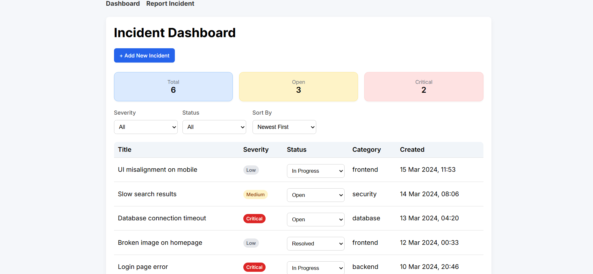
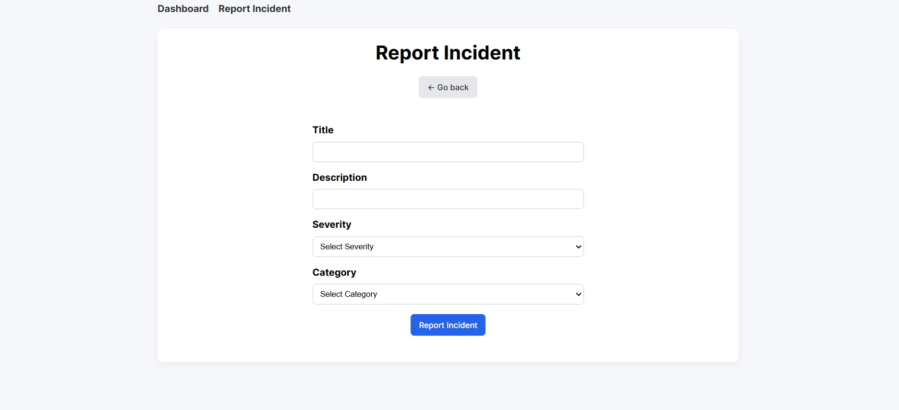

# Incident Management Dashboard 

A modern front-end application for tracking, filtering and managing incidents. Built as a portfolio project to demonstrate strong fundamentals in React, TypeScript and testing.

---

## 🚀 Live Demo

👉🏻 https://incident-management-dashboard.netlify.app/

---

## 📸 Screenshots




---

## 📌 Features 

- Create and manage incidents
- Filter incidents by severity and status
- Sort incidents by date and severity
- Real-time validation with clear error messages
- Persistent data using localStorage
- Responsive design for mobile and desktop
- Human-readable date formatting
- Clean and intuitive UI

---

## 🧠 What This Project Demonstrates 

This project focuses on **practical front-end engineering skills**, not just visuals.

### Core Skills
- Component-based architecture (React)
- Strong type safety (TypeScript)
- Separation of concerns (UI vs logic)
- State management with hooks

### Code Quality
- Reusable utility functions (filtering, sorting, validation, stats, formatting)
- Clean and reusable structure
- Consistent naming and organization

### Testing
- Unit test for core logic implemented with Vitest:
  - filtering
  - sorting
  - validation
  - statistics
- Component testing for form behavior
- Built using Vitest and React Testing Library

### UX Thinking
- Clear validation feedback
- Improved readability with formatted dates
- Consistent spacing and visual hierarchy

---

## 🛠️ Tech Stack
- React
- TypeScript
- Vite
- Vitest
- React Testing Library
- CSS (customs styling)

---

## 🧪 Testing

Run test:
```bash
npm run test
```

The project includes:
- Unit test for business logic
- Component tests for user interactions

---

## ⚙️ Setup & Run Locally

Clone repository:
```bash
git clone https://github.com/AnastasiaCherniakh/incident-management-dashboard
```

Install dependencies:
```bash
npm install
```

Start development server
```bash
npm run dev
```
---

## 📈 Possible Improvements
- Add backend integration (REST API) for persistent multi-user data
- Implement authentication and user specific data management
- Add incident editing and deletion functionality
- Introduce end-to-end (E2E) testing using Playwright to cover full user flows

---

## 💡 Notes

This project was built with a focus on clean architecture, maintainability and real-world development practices.

